# 🚗 Driver State Monitoring System

실시간 카메라 기반 AI 분석을 통해 운전자의 위험 행동을 감지하고,
운행 데이터와 함께 서버로 전송하여 관리자 웹에서 모니터링할 수 있도록
구현한 Android 기반 운전자 상태 모니터링 시스템입니다.

---

## 📷 App Screenshots

| 로그인 | 회원가입 | 메인 | 마이 |
|---|---|---|---|
| 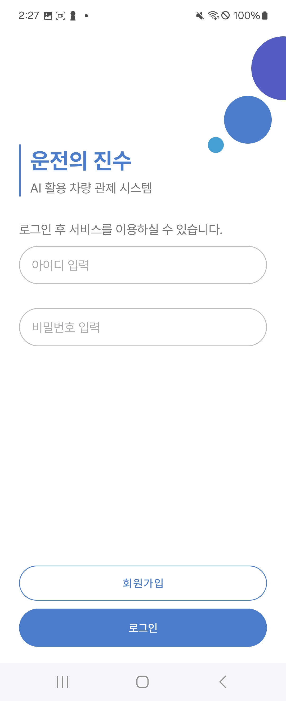 | 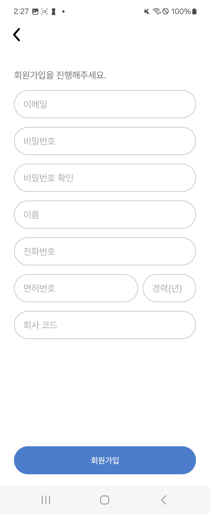 | 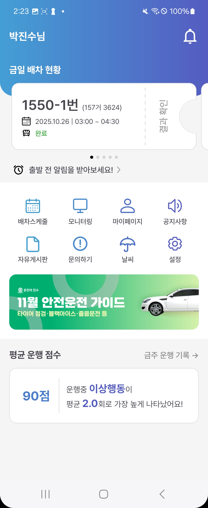 | 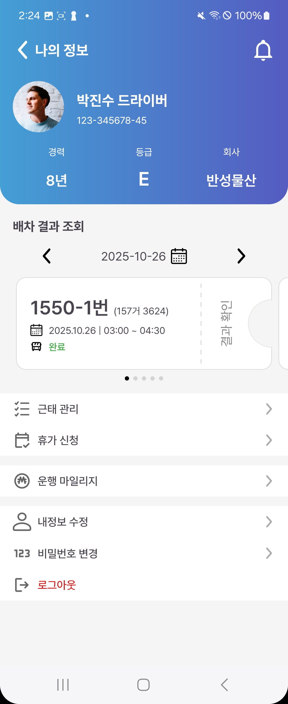 |
| 졸음 감지 | 담배 감지 | 휴대폰 감지 | 미벨트 감지 |
| 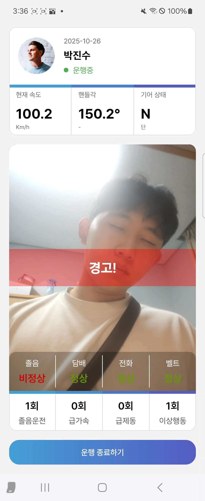 | 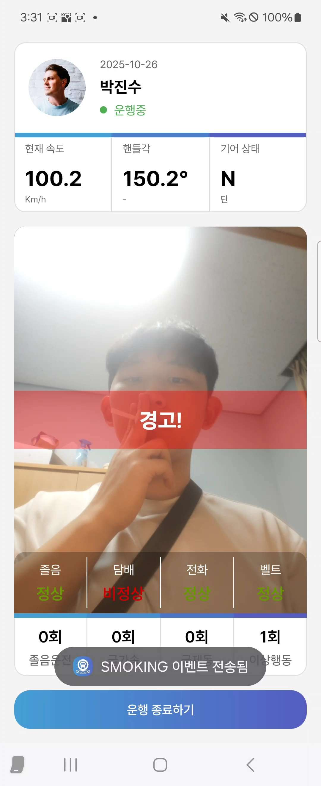 | 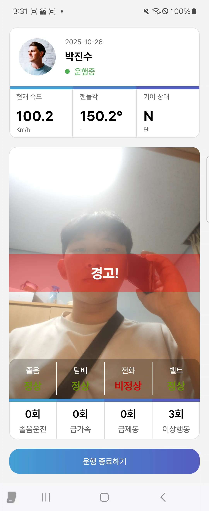 | 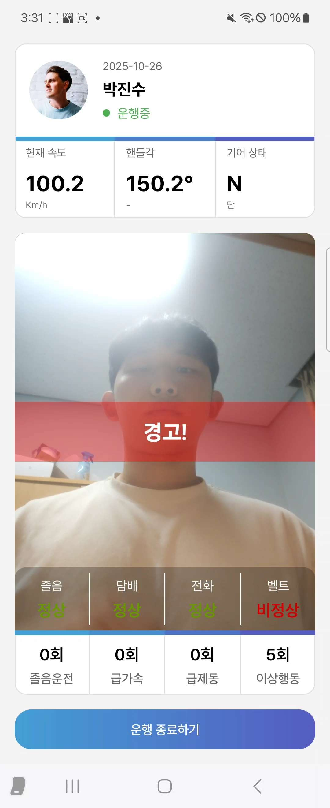 |
| 알람 | 결과 | 통계 | 날씨 |
| 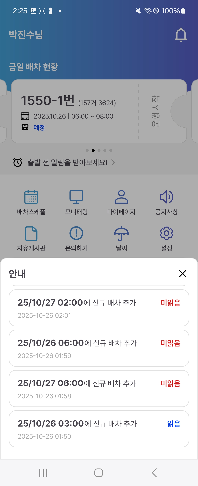 | 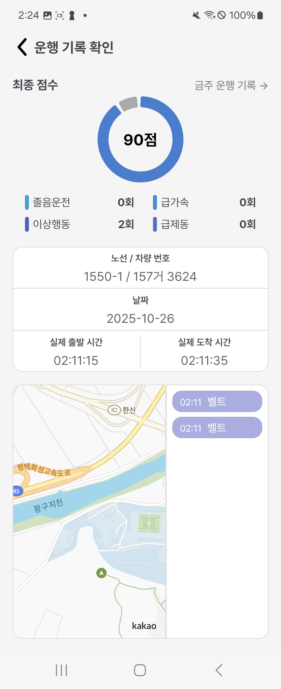 | 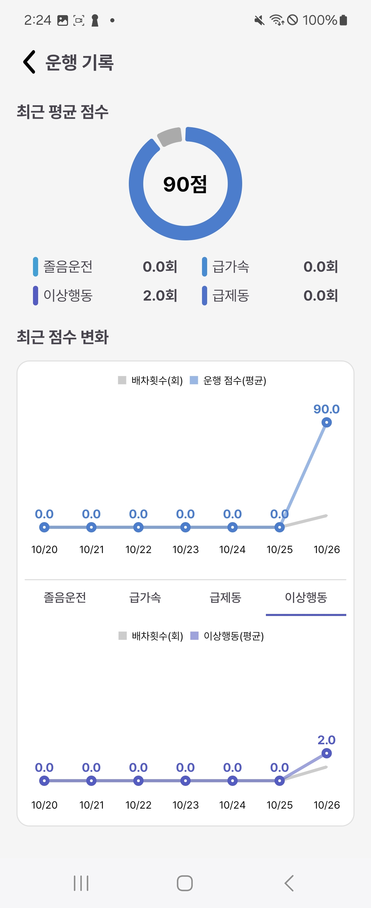 | 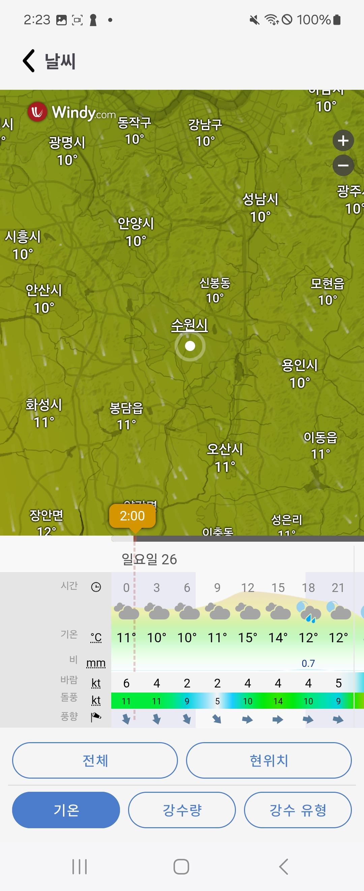 |

---

## 📌 Overview

본 프로젝트는 **AI 기반 영상 분석과 실시간 운행 데이터를 결합하여
운전자 위험 행동을 감지하는 시스템**입니다.

Android 앱은 CameraX 기반 영상 스트림을 분석하여
다음과 같은 위험 행동을 탐지합니다.

- 졸음 운전
- 흡연
- 휴대폰 사용
- 안전벨트 미착용

탐지된 이벤트와 차량 운행 데이터는 서버로 전송되며,
관리자는 웹 대시보드에서 운전자 상태와 운행 정보를 실시간으로 확인할 수 있습니다.

---

## 🏗 System Architecture
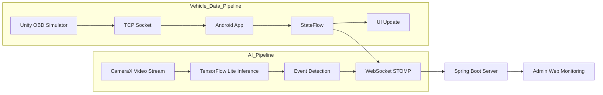
## 🛠 Tech Stack

### 📱 Mobile
Kotlin · Android · CameraX · Coroutines · RxJava2

### 🤖 AI
TensorFlow Lite · YOLOv8 · YOLOv8-Face · MobileNetV2

### 🌐 Network
Retrofit2 · OkHttp · WebSocket(STOMP) · JWT

### 📊 Data Visualization
Kakao Maps SDK · MPAndroidChart

### 🖥 Backend / DevOps
Spring Boot · Docker · Kubernetes

---
## 📂 Project Structure

### 간략 구조
```
androidfront/
└─ app/src/main/java/com/example/android_front/
   ├─ MyApplication.kt
   ├─ ai/             # 모델 핸들링 관련
   ├─ api/            # Retrofit 기반 API 정의 및 토큰 관리
   ├─ model/          # API Request/Response, Enum, Payload 모델
   ├─ adapter/        # RecyclerView/Adapter
   ├─ ui/             # 화면(Activity) 구성
   ├─ service/        # Foreground 서비스
   └─ websocket/      # WebSocket 통신 및 상태 관리
```
<details>
  <summary>상세 구조</summary>
  <pre><code>
androidfront/
└─ app/src/main/java/com/example/android_front/
   ├─ MyApplication.kt
   ├─ ai/
   │  └─ ModelHandler.kt
   ├─ api/
   │  ├─ AuthApi.kt
   │  ├─ DispatchApi.kt
   │  ├─ NotificationApi.kt
   │  ├─ RetrofitInstance.kt
   │  ├─ TokenManager.kt
   │  ├─ UserApi.kt
   │  └─ WarningApi.kt
   ├─ model/
   │  └─ (API request/response, enum, payload models)
   ├─ adapter/
   │  ├─ BannerAdapter.kt
   │  ├─ DispatchEventAdapter.kt
   │  ├─ DispatchPagerAdapter.kt
   │  └─ NotificationAdapter.kt
   ├─ ui/
   │  ├─ LoginActivity.kt
   │  ├─ SignUpActivity.kt
   │  ├─ MainActivity.kt
   │  ├─ MyPageActivity.kt
   │  ├─ RunActivity.kt
   │  ├─ RecordActivity.kt
   │  ├─ AllScoreActivity.kt
   │  ├─ ScheduleActivity.kt
   │  ├─ WeatherActivity.kt
   │  ├─ MonitorActivity.kt
   │  └─ SettingActivity.kt
   ├─ service/
   │  └─ SocketService.kt
   └─ websocket/
      ├─ WebSocketManager.kt
      └─ NotificationState.kt
  </code></pre>
</details>
  
---
## ⚙️ Key Features

### 🚘 AI 기반 운전자 상태 감지

- 졸음 운전 감지
- 흡연 감지
- 휴대폰 사용 감지
- 안전벨트 미착용 감지

### 📡 실시간 운행 데이터 스트리밍

- OBD 시뮬레이터 기반 차량 데이터 수신
- 속도 / RPM / 배터리 / 브레이크 등 운행 정보 표시
- WebSocket 기반 서버 실시간 전송

### 📊 운행 데이터 분석

- 운행 점수 계산
- 그래프 기반 운행 통계 시각화
- 위험 행동 발생 위치 지도 표시

### 📅 배차 및 운행 관리

- 배차 일정 조회
- 배차 알림 수신
- 달력 기반 운행 스케줄 관리

---

## 💡 Implementation Highlights

### 1️⃣ 실시간 데이터 스트리밍 구조 설계
```
Unity OBD Simulator
↓
TCP Socket
↓
StateFlow
↓
UI Update
↓
WebSocket Server
```
실시간 차량 데이터를 **StateFlow 기반으로 관리하여
UI 업데이트와 서버 전송을 분리한 스트리밍 구조**를 설계했습니다.

### 2️⃣ CameraX 기반 실시간 AI 추론 파이프라인

- CameraX 프레임 수신
- YUV → RGB 변환
- TensorFlow Lite 추론
- 이벤트 생성

프레임 단위 비동기 처리 구조를 통해  
**UI 스레드와 AI 추론을 분리하여 ANR을 방지**했습니다.

### 3️⃣ 다중 AI 모델 통합 관리

ModelHandler 싱글톤을 설계하여

- YOLOv8 객체 탐지
- YOLOv8-face 얼굴 탐지
- MobileNetV2 졸음 분류

모델을 **앱 실행 시 1회 로딩 후 재사용하도록 구성하여
메모리 사용량을 최소화**했습니다.

### 4️⃣ 연속 프레임 기반 오탐 방지 정책

단일 프레임 detection 대신

- 안전벨트: **7프레임 연속 미착용**
- 졸음: **2프레임 연속 감지**

정책을 적용하여 **AI 감지 안정성을 개선**했습니다.

### 5️⃣ Android App Architecture

앱 내부 구조를 **Service / Manager / UI Layer**로 분리하여  
각 기능의 책임을 명확하게 설계했습니다.

- SocketService → OBD 데이터 수신
- WebSocketManager → 서버 실시간 통신 관리
- ModelHandler → AI 모델 관리
- Activity / ViewModel → UI 상태 관리

---

## 🔧 Troubleshooting

### 1️⃣ AI 추론 안정화 문제

문제

- 모델 입력 포맷 차이
- 반복 모델 로딩
- 단일 프레임 기반 오탐
- 프레임 드롭 발생

해결

- ModelHandler 싱글톤 구조 설계
- YUV → RGB 변환 최적화
- Threshold 튜닝
- 연속 프레임 기반 이벤트 정책 도입

결과

- 오탐률 감소
- 이벤트 신뢰도 향상
- 프레임 처리 안정성 확보

### 2️⃣ 실시간 통신 안정성 문제

문제

- WebSocket 연결 끊김
- 이벤트 유실 가능성

해결

- REST / WebSocket 통신 분리
- WebSocket 자동 재연결 정책 구현
- StateFlow 기반 연결 상태 관리

결과

- 연결 복구 자동화
- 실시간 이벤트 안정성 확보

### 3️⃣ 확장 가능한 배포 구조 설계

문제

- 단일 서버 구조의 확장성 한계

해결

- Docker 기반 컨테이너화
- Kubernetes 환경 배포 테스트
- Rolling Update 전략 적용

결과

- 확장 가능한 서버 구조 이해
- 컨테이너 기반 배포 환경 경험
