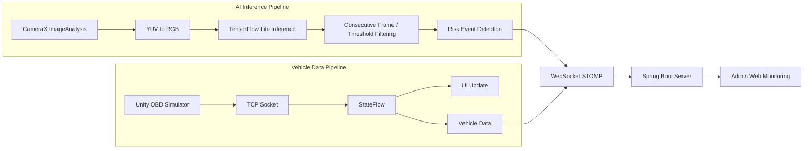

# 🚗 Driver State Monitoring System

실시간 카메라 기반 AI 분석을 통해 운전자의 위험 행동을 감지하고,
운행 데이터와 함께 서버로 전송하여 관리자 웹에서 모니터링할 수 있도록
구현한 Android 기반 운전자 상태 모니터링 시스템입니다.

---

## 🎥 Demo / 📷 App Screenshots

🎥 **Demo Video**

https://github.com/user-attachments/assets/a46e6d63-d22b-4fec-82d7-91e211ee34b1 (2분 이전까지)

| 로그인 | 회원가입 | 메인 | 마이 |
|:---:|:---:|:---:|:---:|
|  |  |  |  |
| 졸음 감지 | 담배 감지 | 휴대폰 감지 | 미벨트 감지 |
|  |  |  |  |
| 알람 | 결과 | 통계 | 날씨 |
|  |  |  |  |

---

## 📌 Overview

본 프로젝트는 **AI 기반 영상 분석과 실시간 운행 데이터를 결합하여
운전자 위험 행동을 감지하는 시스템**입니다.

Android 앱은 CameraX 기반 영상 스트림을 분석하여
다음과 같은 위험 행동을 탐지합니다.

- 졸음 운전
- 흡연
- 휴대폰 사용
- 안전벨트 미착용

탐지된 이벤트와 차량 운행 데이터는 서버로 전송되며,
관리자는 웹 대시보드에서 운전자 상태와 운행 정보를 실시간으로 확인할 수 있습니다.

---

## 🏗 System Architecture

## 🛠 Tech Stack

### 📱 Mobile
Kotlin · Android · MVVM(부분적) · Jetpack (LiveData, Lifecycle, CameraX, FusedLocationProvider) · Coroutines · Flow · RxJava2

### 🤖 AI
TensorFlow Lite · YOLOv8 · YOLOv8-Face · MobileNetV2

### 🌐 Network
Retrofit2 · OkHttp · WebSocket(STOMP) · JWT

### 📊 Data Visualization
Kakao Maps SDK · MPAndroidChart

### 🖥 Backend / DevOps
Spring Boot · Docker · Kubernetes

---
## 📂 Project Structure

### 간략 구조
```
androidfront/
└─ app/src/main/java/com/example/android_front/
   ├─ MyApplication.kt
   ├─ ai/             # 모델 핸들링 관련
   ├─ api/            # Retrofit 기반 API 정의 및 토큰 관리
   ├─ model/          # API Request/Response, Enum, Payload 모델
   ├─ adapter/        # RecyclerView/Adapter
   ├─ ui/             # 화면(Activity) 구성
   ├─ service/        # Foreground 서비스
   └─ websocket/      # WebSocket 통신 및 상태 관리
```
<details>
  <summary>상세 구조</summary>
  <pre><code>
androidfront/
└─ app/src/main/java/com/example/android_front/
   ├─ MyApplication.kt
   ├─ ai/
   │  └─ ModelHandler.kt
   ├─ api/
   │  ├─ AuthApi.kt
   │  ├─ DispatchApi.kt
   │  ├─ NotificationApi.kt
   │  ├─ RetrofitInstance.kt
   │  ├─ TokenManager.kt
   │  ├─ UserApi.kt
   │  └─ WarningApi.kt
   ├─ model/
   │  └─ (API request/response, enum, payload models)
   ├─ adapter/
   │  ├─ BannerAdapter.kt
   │  ├─ DispatchEventAdapter.kt
   │  ├─ DispatchPagerAdapter.kt
   │  └─ NotificationAdapter.kt
   ├─ ui/
   │  ├─ LoginActivity.kt
   │  ├─ SignUpActivity.kt
   │  ├─ MainActivity.kt
   │  ├─ MyPageActivity.kt
   │  ├─ RunActivity.kt
   │  ├─ RecordActivity.kt
   │  ├─ AllScoreActivity.kt
   │  ├─ ScheduleActivity.kt
   │  ├─ WeatherActivity.kt
   │  ├─ MonitorActivity.kt
   │  └─ SettingActivity.kt
   ├─ service/
   │  └─ SocketService.kt
   └─ websocket/
      ├─ WebSocketManager.kt
      └─ NotificationState.kt
  </code></pre>
</details>
  
---
## ⚙️ Key Features

### 🚘 AI 기반 운전자 상태 감지

- 졸음 운전 감지
- 흡연 감지
- 휴대폰 사용 감지
- 안전벨트 미착용 감지

### 📡 실시간 운행 데이터 스트리밍

- OBD 시뮬레이터 기반 차량 데이터 수신
- 속도 / RPM / 배터리 / 브레이크 등 운행 정보 표시
- WebSocket 기반 서버 실시간 전송

### 📊 운행 데이터 분석

- 운행 점수 계산
- 그래프 기반 운행 통계 시각화
- 위험 행동 발생 위치 지도 표시

### 📅 배차 및 운행 관리

- 배차 일정 조회
- 배차 알림 수신
- 달력 기반 운행 스케줄 관리

---

## 💡 Implementation Highlights

### 1️⃣ 실시간 데이터 스트리밍 구조 설계
```
Unity OBD Simulator
↓
TCP Socket
↓
StateFlow
↓
UI Update
↓
WebSocket Server
```
- Unity OBD Simulator의 차량 데이터를 TCP Socket으로 수신하고, 
이를 앱 내 StateFlow로 관리하여 최신 운행 상태를 지속적으로 반영했습니다.
- 스트림 처리와 최신 상태 유지에 적합한 StateFlow를 기반으로 속도, RPM, 브레이크 등 차량 정보를 UI에 표시하는 흐름과,
서버로 전송하는 흐름을 분리해 실시간 데이터 처리 구조를 구성했습니다.
- 위험 이벤트와 차량 상태 데이터는 WebSocket(STOMP) 으로 서버에 전달하여 
관리자 웹에서 실시간 모니터링할 수 있도록 구현했습니다.

### 2️⃣ CameraX 기반 실시간 AI 추론 파이프라인
```
CameraX Frame
↓
YUV → RGB 변환
↓
TFLite 추론
↓
confidence threshold와 연속 프레임 기반 이벤트 판정 로직
↓
위험 이벤트
```

- CameraX의 ImageAnalysis를 활용해 카메라 프레임을 ImageProxy 형태로 수집하고, 
모델 입력 포맷에 맞도록 YUV → RGB 변환, 회전 보정, 텐서 전처리를 거쳐 TensorFlow Lite 추론을 수행했습니다.
- 분석용 executor를 분리하여 프레임 수집/AI 추론과 UI 업데이트를 비동기 구조로 분리함으로써, 
실시간 처리 중에도 메인 스레드가 막히지 않도록 설계했습니다.
- 모델 결과를 곧바로 경고로 사용하지 않고, 
confidence threshold와 연속 프레임 기반 이벤트 판정 로직을 적용해 순간 노이즈와 가림으로 인한 오탐을 줄였습니다.

### 3️⃣ 다중 AI 모델 통합 관리

- ModelHandler 싱글톤을 통해 YOLOv8, YOLOv8-Face, MobileNetV2 모델의 로딩과 추론 진입점을 통합 관리했습니다.
- 휴대폰 사용, 흡연, 안전벨트 미착용처럼 객체의 존재와 위치를 판단해야 하는 항목은 YOLO 계열 모델로 처리하고, 
졸음처럼 얼굴 영역 기반 상태 분류가 필요한 항목은 MobileNetV2로 분리해 적용했습니다.
- 여러 모델을 프레임 단위로 반복 호출해야 했기 때문에, 
앱 실행 시 1회 로딩 후 재사용 구조를 적용하여 로딩 시간과 메모리 사용량을 최소화했습니다.

### 4️⃣ 연속 프레임 기반 오탐 방지 정책

단일 프레임 detection 대신

- 안전벨트: **7프레임 연속 미착용**
- 졸음: **2프레임 연속 감지**

정책을 적용하여 **AI 감지 안정성을 개선**했습니다.

### 5️⃣ Android App Architecture

앱 내부 구조를 **Service / Manager / UI Layer**로 분리하여  
각 기능의 책임을 명확하게 설계했습니다.

- SocketService → OBD 데이터 수신
- WebSocketManager → 서버 실시간 통신 관리
- ModelHandler → AI 모델 관리
- Activity / ViewModel → UI 상태 관리

---

## 🔧 Troubleshooting

### 1️⃣ 실시간 AI 추론 과정에서의 프레임 드롭 문제

❌ 문제

CameraX 기반 실시간 프레임 분석과 다중 모델 추론을 수행하는
과정에서, 전처리·추론·후처리 비용이 누적되며 프레임 드롭과
처리 지연이 발생할 수 있었습니다.

🛠 해결

- ModelHandler 싱글톤으로 모델을 앱 실행 시 1회 로딩 후 재사
용해 반복 초기화 비용을 줄였습니다.
- 공통 가능한 입력 전처리 흐름을 정리하고, 모델별 차이가 필요한
부분만 분리해 처리 일관성을 높였습니다.
- 추론 결과를 단일 프레임마다 바로 이벤트화하지 않고, 임계값과
연속 프레임 기준을 적용해 불필요한 이벤트 발생과 후속 처리 비
용을 줄였습니다.
- Backpressure 전략을 적용하여, 처리 지연 시 오래된 프레임을
누적하지 않고 최신 프레임 기준으로 분석하였습니다.

📈 결과

실시간 추론 파이프라인의 처리 부담을 완화하고, 프레임 드롭을
줄이는 방향으로 앱 동작 안정성을 개선했습니다.

### 2️⃣ 실시간 데이터 플로우 안정성 문제

❌ 문제

- OBD 데이터가 TCP Socket을 통해 지속적으로 들어오는 상황에
서, 이를 UI 표시와 서버 전송에 동시에 활용해야 했습니다. OBD
데이터 수신, UI 갱신, 서버 전송이 동시에 이루어지는 구조에서
실시간 처리 흐름이 복잡해질 수 있었습니다.

🛠 해결

- OBD 데이터는 앱 내부에서 StateFlow로 관리하여 최신 상태를
유지하고, 이를 구독하는 방식으로 UI 업데이트와 서버 전송 흐름
을 분리했습니다.
- 차량 상태 및 위험 이벤트 전송은 WebSocket(STOMP) 으로 처
리하고, 연결 종료나 heartbeat 실패 시 자동 재연결 로직을 적용
해 실시간 전송 안정성을 보완했습니다.

📈 결과

앱 내부 데이터 흐름과 서버 전송 구조를 분리해 실시간 운행 데이
터 처리의 안정성을 높였습니다.

### 3️⃣ 확장 가능한 배포 구조 설계

❌ 문제

- 단일 서버 구조의 확장성 한계

🛠 해결

- Docker 기반 컨테이너화
- Kubernetes 환경 배포 테스트
- Rolling Update 전략 적용

📈 결과

- 확장 가능한 서버 구조 이해
- 컨테이너 기반 배포 환경 경험
